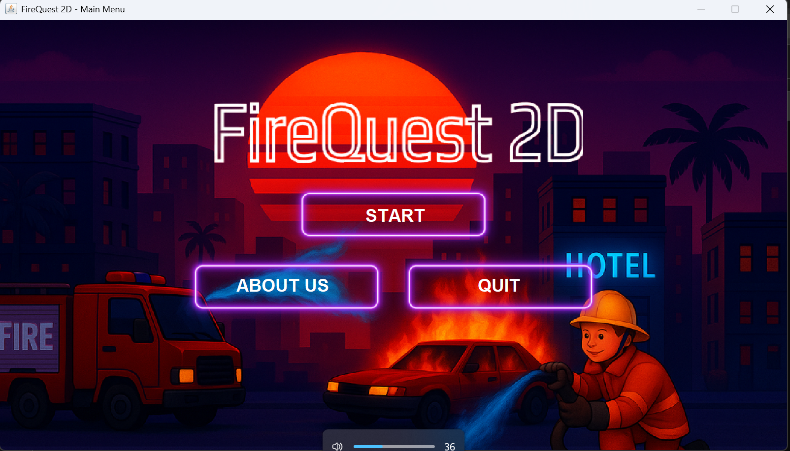
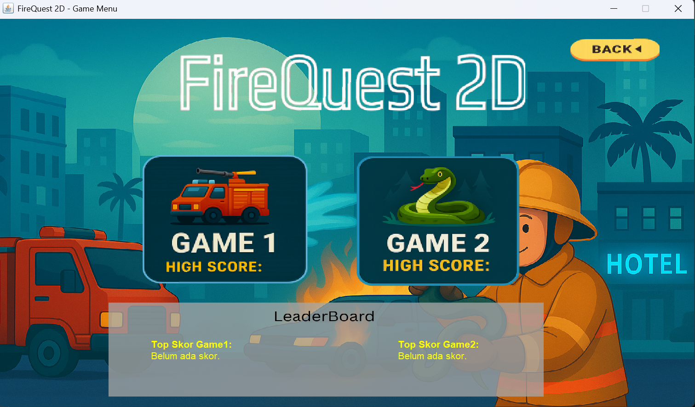
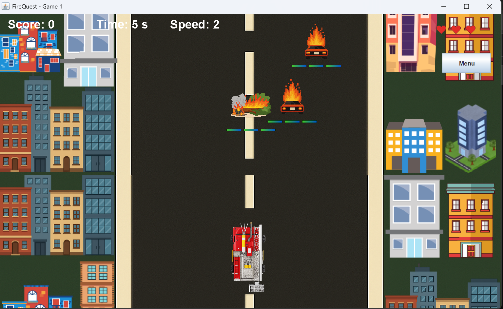
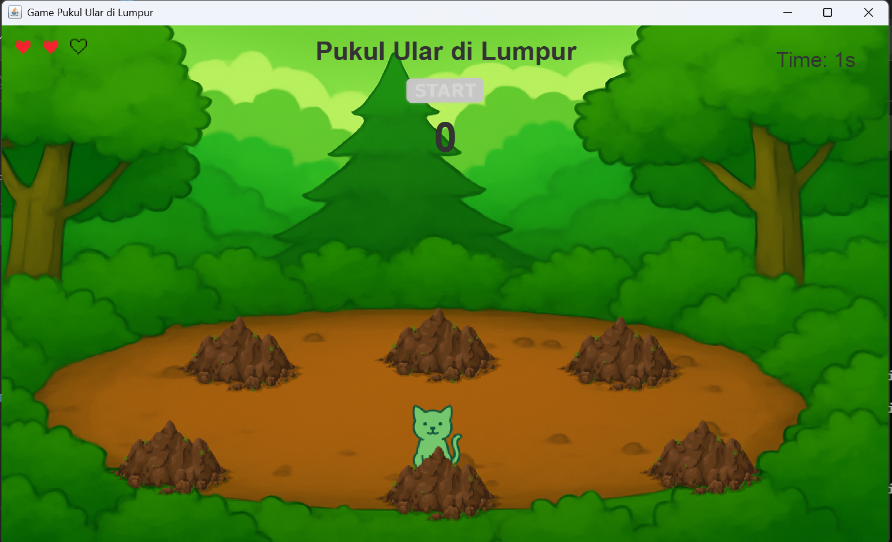

# 🔥 FireQuest 2D - A Java Game Suite

Sebuah aplikasi game desktop yang dibangun sepenuhnya menggunakan Java Swing. FireQuest 2D berfungsi sebagai hub untuk beberapa mini-game dengan tema petualangan pemadam kebakaran. Proyek ini mendemonstrasikan kemampuan dalam pengembangan game 2D, manajemen state, dan desain antarmuka grafis (GUI) di Java.

## Galeri & Tampilan Aplikasi

| Main Menu | Game Selection & Leaderboard |
| :---: | :---: |
|  |  |
| **Game 1: Fire-Truck Dodger** | **Game 2: Pukul Ular di Lumpur** |
|  |  |

## Fitur Utama (Key Features)

-   **Menu Utama Interaktif:** Dilengkapi dengan tombol Start, About Us, Quit, dan efek suara.
-   **Hub Pemilihan Game:** Pengguna dapat memilih salah satu dari dua mini-game yang tersedia.
-   **Papan Peringkat (Leaderboard):** Sistem untuk mencatat dan menampilkan skor tertinggi untuk masing-masing game.
-   **Game 1 (Fire-Truck Dodger):** Game bergaya *endless runner* di mana pemain harus menghindari rintangan di jalan untuk mendapatkan skor.
-   **Game 2 (Pukul Ular di Lumpur):** Game bergaya *whac-a-mole* yang menguji kecepatan dan reaksi pemain.
-   **Sistem Gameplay:** Meliputi skor, waktu, kecepatan, dan sistem nyawa (lives).
-   **Manajemen Audio:** Terdapat kelas khusus untuk mengelola musik latar (BGM) dan efek suara (SFX).
-   **Aset Grafis Kustom:** Menggunakan gambar dan aset 2D yang didesain khusus untuk menciptakan pengalaman visual yang kohesif.

## Teknologi yang Digunakan (Tech Stack)

-   **Java:** Bahasa pemrograman utama.
-   **Java Swing:** Untuk semua komponen antarmuka grafis (GUI), window, dan rendering.
-   **Java AWT:** Digunakan bersama Swing untuk menangani event, grafis, dan audio.

## Cara Menjalankan Proyek (Local Setup & Run)

**1. Prasyarat**
-   JDK (Java Development Kit) versi 8 atau yang lebih baru.

**2. Langkah-langkah**
   1.  **Clone atau Unduh Repository:**
       ```bash
       git clone [https://github.com/fahminashruddin/FireQuest2D.git](https://github.com/fahminashruddin/FireQuest2D.git)
       ```
   2.  **Buka di Terminal:** Masuk ke direktori utama proyek melalui terminal atau command prompt.
       ```bash
       cd FireQuest2D
       ```
   3.  **Kompilasi Semua File Java:**
       ```bash
       javac *.java
       ```
       *(Perintah ini akan mengkompilasi semua file .java menjadi .class, termasuk kelas-kelas internal seperti `Game1$1.class` secara otomatis).*

   4.  **Jalankan Game:**
       ```bash
       java MainMenu
       ```
       *(**Penting:** Ganti `MainMenu` dengan nama class utama Anda yang berisi method `public static void main(String[] args)` untuk memulai game. Berdasarkan screenshot, kemungkinan besar nama class-nya adalah `MainMenu` atau `FireQuest2D`)*.

## Struktur Proyek

Struktur folder proyek ini diorganisir sebagai berikut:
-   `asset/`: Berisi file-file audio (musik dan efek suara).
-   `images/`: Berisi semua aset grafis yang digunakan dalam game (sprite, background, tombol).
-   `screenshots/`: Berisi gambar-gambar untuk dokumentasi README.
-   `*.java`: Semua file kode sumber utama dari game.
-   `*.class`: Hasil kompilasi dari file-file Java.

## Lisensi
Proyek ini dilisensikan di bawah [MIT License](LICENSE).
